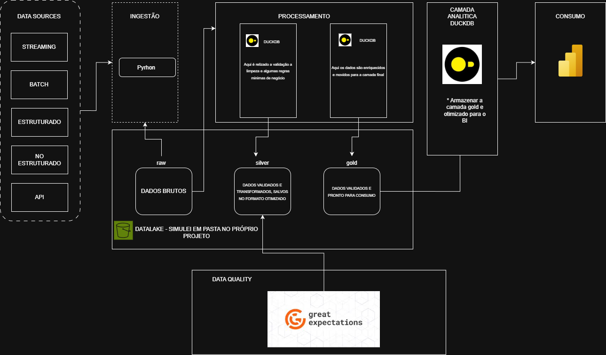
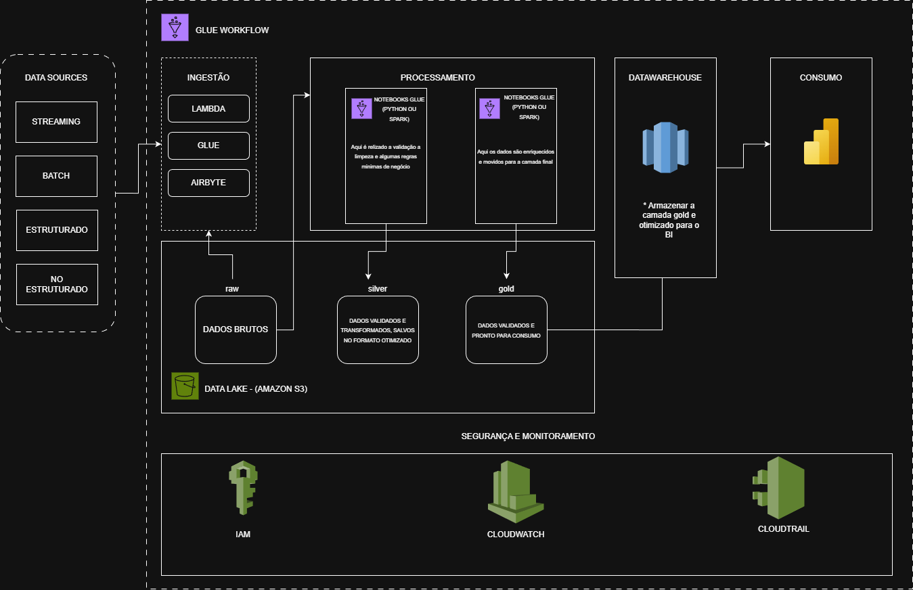

# 📊 Pokémon Data Pipeline

## 📌 Visão Geral do Projeto

Este projeto implementa um **pipeline de dados end-to-end** consumindo dados da **PokéAPI**, seguindo boas práticas de **Engenharia de Dados**.

O objetivo é extrair dados brutos da API, transformar e organizar esses dados em uma camada analítica confiável (**Silver**), aplicar **validações de qualidade**, e garantir que apenas dados consistentes avancem no pipeline.

A arquitetura segue o padrão clássico:



-- CONSIDERAÇÕES: Optei por executar localmente para reduzir custo e complexidade operacional do desafio, mantendo o desenho arquitetural compatível com cloud. Usei DuckDB e pastas simulando o Data Lake (raw/silver/gold) porque isso me permite validar o pipeline, qualidade e modelagem de ponta a ponta. Em um cenário produtivo, a mesma arquitetura é portável para AWS trocando storage local por S3 e orquestração/execução por serviços gerenciados (Glue/Lambda/Step Functions), sem mudar o conceito.


-- Caso optemos por seguir desenvolvendo a mesma arquitetura em nuvem também realizei o desenho da arquitetura 


---

## 🧠 Objetivos do Projeto

- Consumir dados de uma API pública (PokéAPI)
- Organizar os dados em camadas bem definidas
- Transformar dados semi-estruturados em dados analíticos
- Aplicar validações de qualidade na camada Silver
- Interromper o pipeline automaticamente em caso de inconsistência
- Demonstrar boas práticas de organização, clareza e simplicidade

---

## 🗂️ Arquitetura do Projeto

```
project-pokemon/
│
├── data/
│   ├── raw/
│   │   ├── raw_pokeapi_pokemon_details.json
│   │   └── raw_pokeapi_evolutions.json
│   │
│   ├── silver/
│   │   ├── pokemon_silver.parquet
│   │   ├── pokemon_types_silver.parquet
│   │   ├── pokemon_stats_silver.parquet
│   │   └── evolutions.parquet
│   │
│   └── gold/   (opcional / não utilizada neste projeto)
│
├── extraction/
│   ├── extract_pokemons.py
│   ├── extract_evoluations.py
│   ├── extraction_main.py
│   └── utils.py
│
├── transformation/
│   ├── pokemon_silver.py
│   ├── pokemon_types_silver.py
│   ├── pokemon_stats_silver.py
│   ├── evolutions_silver.py
│   ├── transformation_main.py
│   └── utils_transformation.py
│
├── data_quality/
│   └── validate_silver.py
│
├── main.py
├── pokemon.duckdb
├── README.md
└── .gitignore
```

---

## ⚙️ Tecnologias Utilizadas

- **Python 3.12**
- **Requests** – Consumo da PokéAPI
- **DuckDB** – Processamento e persistência local
- **Parquet** – Formato colunar otimizado
- **Pandas** – Manipulação de dados
- **Great Expectations** – Validação de qualidade dos dados

---

## 🚀 Como Clonar e Executar o Projeto

### 1️⃣ Clonar o repositório
```bash
git clone https://github.com/seu-usuario/project-pokemon.git
cd project-pokemon
```

### 2️⃣ Criar e ativar o ambiente virtual
```bash
python -m venv venv
```

**Windows**
```bash
venv\Scripts\activate
```

**Linux / Mac**
```bash
source venv/bin/activate
```

### 3️⃣ Instalar as dependências
```bash
pip install requests pandas duckdb pyarrow great-expectations
```

---

## ▶️ Executar o Pipeline

Para executar todo o pipeline, basta rodar:

```bash
python main.py
```

### O pipeline executa as seguintes etapas:

1. **Extração**
   - Consome dados da PokéAPI
   - Salva os dados brutos em formato JSON na camada `raw`

2. **Transformação (Silver)**
   - Normaliza estruturas aninhadas (types, stats e evolutions)
   - Converte os dados para formato Parquet
   - Organiza os dados para uso analítico

3. **Validação de Qualidade**
   - Aplica regras de qualidade sobre os arquivos Parquet da camada Silver
   - O pipeline é interrompido automaticamente caso alguma validação falhe

---

## 🧪 Validações de Qualidade Implementadas

As validações são aplicadas diretamente sobre a camada **Silver**, utilizando **Great Expectations com Pandas**.

### Exemplos de regras aplicadas:
- `pokemon_id` não pode ser nulo
- `pokemon_id` deve ser único
- Tipos devem respeitar os slots válidos (1 ou 2)
- Stats devem pertencer ao conjunto esperado:
  - `hp`, `attack`, `defense`, `special-attack`, `special-defense`, `speed`
- Valores numéricos devem estar dentro de limites válidos

Essas validações garantem que apenas dados confiáveis avancem no pipeline.

---

## 🧠 Decisões de Arquitetura

- **Parquet na camada Silver** para melhor performance e organização
- **Validação após transformação**, evitando propagação de dados inconsistentes
- **DuckDB** como solução leve e eficiente para processamento local
---

